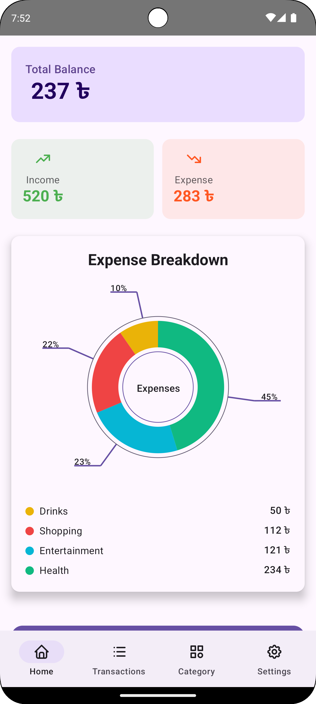
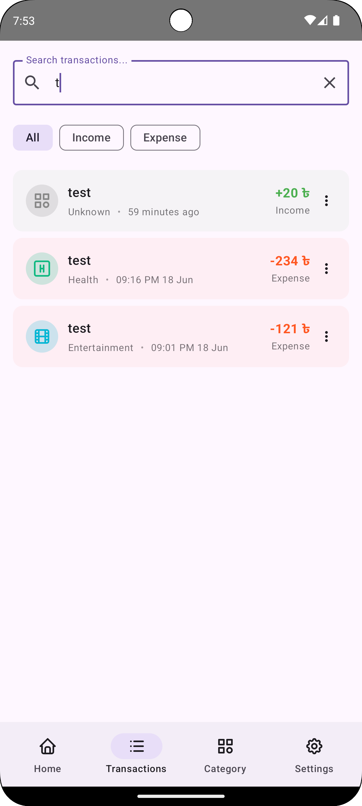
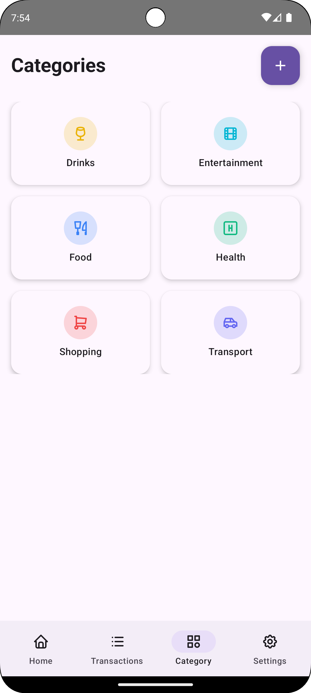
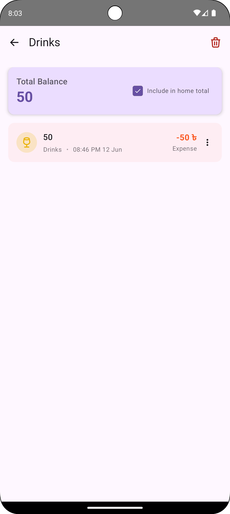
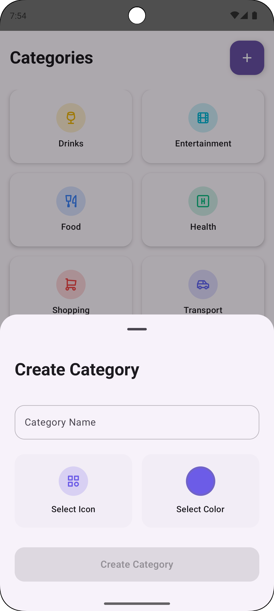
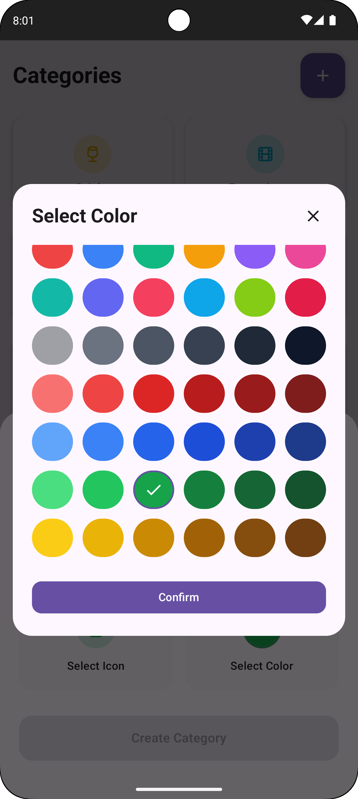
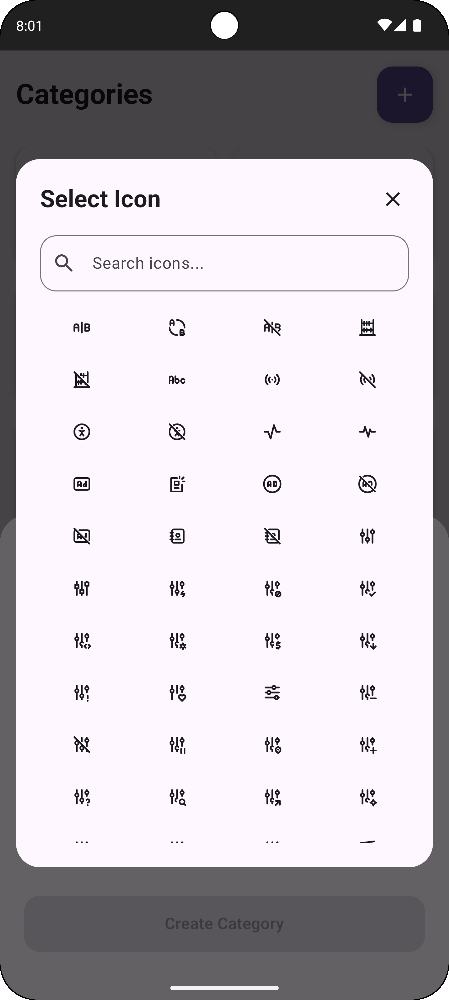
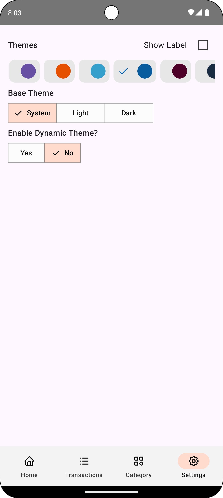

# 💰 Expense Tracker

A beautiful and feature-rich expense tracking app built with Jetpack Compose, offering comprehensive financial management with a modern Material 3 design.

## 🚀 Download

### Direct APK Download

## 🆕 What's New (v2.0)

### 🧮 Calculator-Based Input
- calculator for adding/editing expenses
- Support for expressions like `200 + 50`, `500 - 120`
- Live preview of calculated amount
- Operators: +, −, ×, ÷

### 📊 Advanced Insights & Analytics
- Dedicated analytics screen with beautiful charts
- Filter by Today, Week, Month, Year, or custom range
- Total spent, daily average, highest spending day
- Category breakdown with progress bars

### 💰 Budget Management
- Set monthly overall budget limits
- Optional per-category budgets
- Visual warnings at configurable thresholds (50-95%)
- Track remaining budget in real-time

### 🗑️ Soft Delete & Trash
- Deleted items go to Trash instead of permanent deletion
- Restore accidentally deleted transactions
- Auto-delete after 30 days
- Empty trash option

### 📤 Data Export & Import
- Export to JSON (full backup with all data)
- Export to CSV (Excel-compatible)
- Date-range export support
- Import with duplicate handling (Skip/Merge/Overwrite)
- Schema version checking for compatibility

### 📝 Notes & Tags
- Add notes to any transaction
- Custom tags for better organization
- Search by notes and tags

### 🔐 App Lock & Security
- Optional PIN lock (4-digit)
- Biometric (fingerprint) authentication
- Auto-lock on app exit
- Secure PIN storage with SHA-256 hashing

### 🔍 Smart Search
- Search by amount, category, description
- Search by notes and tags
- Date range filtering
- Optimized Room queries with indexes

---

## ✨ Features

### 📊 Financial Management
- **Track Income & Expenses** - Monitor your financial transactions with ease
- **Category Management** - Create, edit, and delete custom categories
- **Bulk Operations** - Delete all expenses under a category at once
- **Visual Analytics** - Beautiful pie chart breakdown of your expenses
- **Budget Limits** - Set and track monthly spending limits

### 🎨 User Experience
- **Material 3 Design** - Modern, clean, and intuitive interface
- **Dark/Light Theme** - Built-in dark mode support
- **Color Picker** - Personalize categories with custom colors
- **Beautiful Icons** - Thoughtfully designed iconography
- **Calculator Input** - Natural expense entry with expressions

### 🔍 Transaction Management
- **Transaction History** - View all your financial records
- **Advanced Filtering** - Filter by all, income,expense,tags and date range transactions
- **Search Functionality** - Smart search across all fields
- **Edit/Delete** - Modify or remove transactions as needed
- **Soft Delete** - Recover deleted items from Trash

### 🔒 Security & Privacy
- **App Lock** - PIN and biometric protection
- **Encrypted Storage** - Secure local data storage
- **Offline-First** - Works completely offline
- **No Internet Required** - Your data never leaves your device

### 📤 Backup & Restore
- **JSON Export** - Full backup of all data
- **CSV Export** - Open in Excel or Google Sheets
- **Easy Import** - Restore from backup files
- **Schema Versioning** - Future-proof backups

### 🛠 Technical Features
- **Type-Safe Navigation** - Built with Jetpack Compose Navigation
- **Dependency Injection** - Powered by Koin
- **Ad-Free Experience** - No advertisements, completely free

## 📱 Screenshots

  
  
  
  
  
  
  
  

## 📄 License

This project is licensed under the MIT License - see the [LICENSE](LICENSE) file for details.

## 📧 Contact

If you have any questions or suggestions, feel free to reach out:

- GitHub: [@0xJihan](https://github.com/0xJihan)

---

⭐ If you found this project helpful, please give it a star on GitHub!
